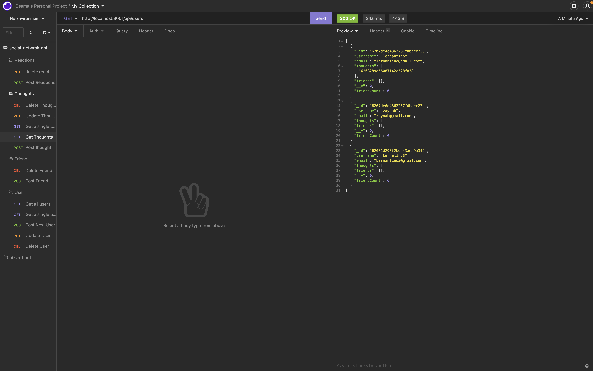

# NoSQL-SocialNetwork-API

## Description
* NoSQL-SocialNetwork-API is a backend database that is designed to use with a social media application. Users can post thoughts, while other users can post reactions to those thoughts. A user can also have a friends list. 

## Built With
* NoSQL(MongoDB)
* Mongoose
* Express.js

## Screenshot
* Insomnia Routes (GET all users route diplayed on the right)

## Link to Walkthrough Video
* Placeholder Link

## Contribution
NoSQL-SocialNetwork-API mad with love by Osama Dahnoun ❤️